# Análisis de calidad de datos NGS

**Estudiante:** Pablo Valenzuela-Carvajal

**Profesor:** Dr. Ricardo Verdugo

**Curso:** Bioinformática e investigación reproducible para análisis genómicos  

**Sesión:** 2.1  

**Fecha:** 30-09-2026

---

## 1.1 Análisis mediante comandos Unix

En este ejercicio se nos pide mediante comandos unix realizar lo siguiente a 4 archivos con extensión .fastq.gz: 

   * Contar el número de lecturas (reads) en un archivo fastq
   * Previsualizar las primeras 40 líneas del mismo archivo fastq
   * Ubicar la lectura 3 e identificar la información disponible. Describir en detalle la información entregada. ¿Donde se entrega la calidad del read?, ¿Cuál es el ID (identificador) del read? Etc. Utilice fechas y etiquetas para identificar cada parte.
   * Traducir el código de calidad para las primeras 10 bases del tercer read a valores numéricos (Q) usando la codificación entregada en clase.

Para aquello crearemos un script en bash para poder hacer lo solicitado, el script se llama `script1.1.sh`, esta parte se estructurará segun el archivo .fastq.gz analizado 

### 1.1.1 S13.R1.fastq.gz

Correremos el script en este archivo que corresponde a las lecturas forward de la secuenciación Pair-End. donde podemos observar que la cantidad de lecturas son 30352, en la Figura 1.1 tambien podemos visualizar el comienzo de las 40 lineas de ese mismo archivo .fastq.gz

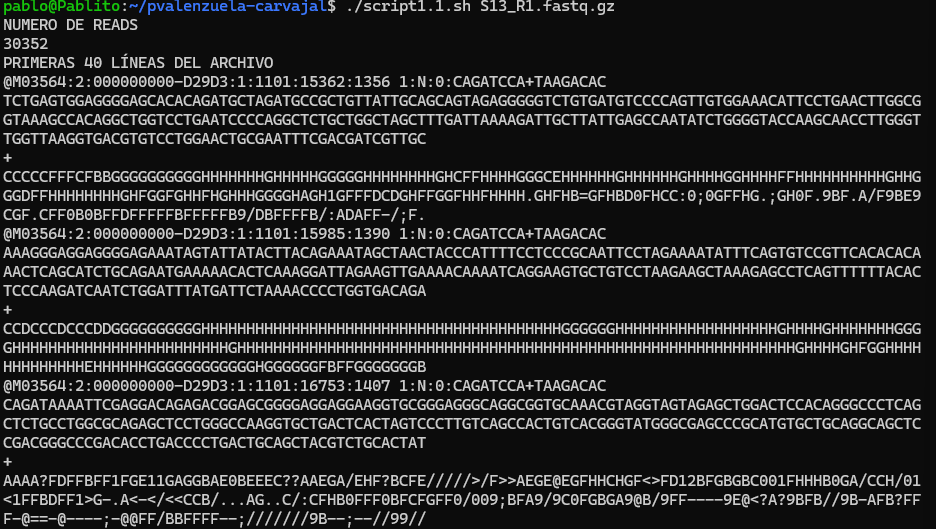
**Figura 1.1.** *La consola de unix mostrando el resultado de correr el script1.1.sh sobre el archivo S13.R1.fastq.gz. Podemos observar que en el inicio nos indica la cantidad de reads del archivo y que despues muestra las primeras 40 lineas del archivo*

Luego lo que sigue del script se puede observar en la Figura 1.2, que corresponde a la impresión del tercer read (lineas 9-12) y de la calidad en ASCI de las primeras 10 bases del read, aqui la calidad del Read se entrega en la cuarta linea, el identificador del read se muestra en la primera linea, en el texto que le sigue al simbolo @ y la segunda linea corresponde a la secuencia 

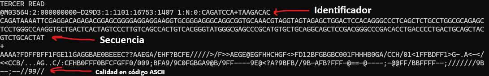
**Figura 1.2.** *La continuación de la figura 1 luego de correr el script1.1.sh sobre S13.R1.fastq.gz. Podemos observar que nos indica la información del tercer read, que incluye su identificador, su secuencia y la calidad en codigo ASCII, ademas nos entrega la calidad en codigo ASCII de las primeras 10 bases del read*

El codigo de calidad de las primeras 10 bases es `AAAA?FDFFB` y su puntuacion Phred es `32 32 32 32 30 37 35 37 37 33`

### 1.1.2 S13.R2.fastq.gz

Correremos el script en este archivo que corresponde a las lecturas reverse de la secuenciación Pair-End. como se indica en la Figura 1.3 donde podemos observar que la cantidad de lecturas son 30352, en la Figura 1 tambien podemos visualizar el comienzo de las 40 lineas de ese mismo archivo .fastq.gz

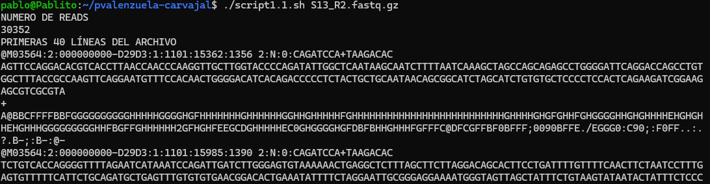
**Figura 1.3.** *La consola de unix mostrando el resultado de correr el script1.1.sh sobre el archivo S13.R2.fastq.gz. Podemos observar que en el inicio nos indica la cantidad de reads del archivo y que despues muestra las primeras 40 lineas del archivo*

Luego lo que sigue del script se puede observar en la Figura 1.4, que corresponde a la impresión del tercer read (lineas 9-12) y de la calidad en ASCI de las primeras 10 bases del read, aqui la calidad del Read se entrega en la cuarta linea, el identificador del read se muestra en la primera linea, en el texto que le sigue al simbolo @ y la segunda linea corresponde a la secuencia 

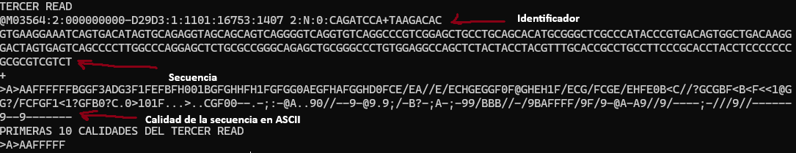
**Figura 1.4.** *La continuación de la figura 1 luego de correr el script1.1.sh sobre S13.R2.fastq.gz. Podemos observar que nos indica la información del tercer read, que incluye su identificador, su secuencia y la calidad en codigo ASCII, ademas nos entrega la calidad en codigo ASCII de las primeras 10 bases del read*

El codigo de calidad de las primeras 10 bases es `>A>AAFFFFF` y su puntuacion Phred es `29 32 29 32 32 37 37 37 37 37`

### 1.1.3 S13.R2_filter.fastq.gz

Correremos el script en este archivo que corresponde a las lecturas reverse filtradas de la secuenciación Pair-End. como se indica en la Figura 1.5 donde podemos observar que la cantidad de lecturas son 26020, en la Figura 1 tambien podemos visualizar el comienzo de las 40 lineas de ese mismo archivo .fastq.gz

**Figura 1.5.** *La consola de unix mostrando el resultado de correr el script1.1.sh sobre el archivo S13.R1_filter.fastq.gz. Podemos observar que en el inicio nos indica la cantidad de reads del archivo y que despues muestra las primeras 40 lineas del archivo*

Luego lo que sigue del script se puede observar en la Figura 1.6, que corresponde a la impresión del tercer read (lineas 9-12) y de la calidad en ASCI de las primeras 10 bases del read, aqui la calidad del Read se entrega en la cuarta linea, el identificador del read se muestra en la primera linea, en el texto que le sigue al simbolo @ y la segunda linea corresponde a la secuencia 

**Figura 1.6.** *La continuación de la figura 1 luego de correr el script1.1.sh sobre S13.R1_filter.fastq.gz. Podemos observar que nos indica la información del tercer read, que incluye su identificador, su secuencia y la calidad en codigo ASCII, ademas nos entrega la calidad en codigo ASCII de las primeras 10 bases del read*

El codigo de calidad de las primeras 10 bases es `DDEEDFEEEE` y su puntuacion Phred es `35 35 36 36 35 37 36 36 36 36`

### 1.1.4 S13.R2_filter.fastq.gz

Correremos el script en este archivo que corresponde a las lecturas reverse filtradas de la secuenciación Pair-End. como se indica en la Figura 1.7 donde podemos observar que la cantidad de lecturas son 26020, en la Figura 1 tambien podemos visualizar el comienzo de las 40 lineas de ese mismo archivo .fastq.gz

**Figura 1.7.** *La consola de unix mostrando el resultado de correr el script1.1.sh sobre el archivo S13.R2_filter.fastq.gz. Podemos observar que en el inicio nos indica la cantidad de reads del archivo y que despues muestra las primeras 40 lineas del archivo*

Luego lo que sigue del script se puede observar en la Figura 1.8, que corresponde a la impresión del tercer read (lineas 9-12) y de la calidad en ASCI de las primeras 10 bases del read, aqui la calidad del Read se entrega en la cuarta linea, el identificador del read se muestra en la primera linea, en el texto que le sigue al simbolo @ y la segunda linea corresponde a la secuencia 

**Figura 1.8.** *La continuación de la figura 1 luego de correr el script1.1.sh sobre S13.R2_filter.fastq.gz. Podemos observar que nos indica la información del tercer read, que incluye su identificador, su secuencia y la calidad en codigo ASCII, ademas nos entrega la calidad en codigo ASCII de las primeras 10 bases del read*

El codigo de calidad de las primeras 10 bases es `ABBCCFFDDD` y su puntuacion Phred es `32 33 33 34 34 37 37 35 35 35`

### 1.2 Archivo .bed 

Luego se nos pedia analizar un archivo .bed, lo que se nos solicitaba era lo siguiente: 

   * Determinar el número de regiones blanco en el panel, analizando el archivo `ls 181004_curso_calidad_datos_NGS/regiones_blanco.bed`
   * Genere una lista de símbolos de genes encestados (solo valores distintos) 
   * Cuente cuántos genes hay en la lista

Podemos ver el flujo de trabajo para responder esto en la Figura 1.9. El numero de regiones blanco en el panel es de 369 y luego de generar la lista de simbolos de los genes encestados (con solo genes unicos) contabilizamos que hay 27 genes unicos en la lista. 

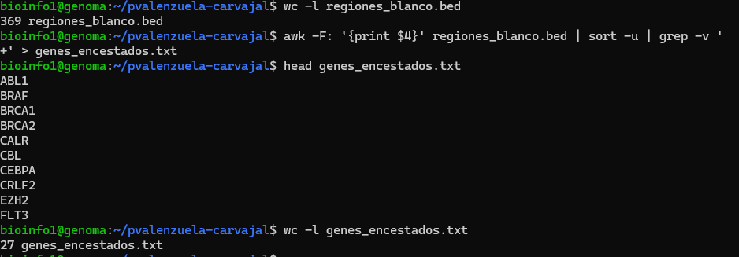 
**Figura 1.9.** *Pipeline de filtrado de genes en regiones de interés. A partir de 369 regiones genómicas se filtraron mediante el uso de pipes que incluyen awk, sort y grep, obteniendo una lista final de 27 genes unicos.*

## 2.1 Generación un informe de calidad con FastQC para una muestra

R1 y R2 sin filtrar muestran fallos en contenido por base, contenido GC, duplicación y secuencias sobrerrepresentadas. Estos resultados pueden estar asociados a la presencia de adaptadores en las secuencias crudas, a una disminución de la calidad hacia las colas de las lecturas, a posibles secuencias contaminantes, entre otras causas.

R1_filter y R2_filter presentan mejoras: el contenido por base pasa de FAIL a WARNING, y el número de secuencias disminuye (~26,000), lo que indica que se eliminaron lecturas de baja calidad o adaptadores. Sin embargo, continuan los fallos en contenido GC (que puede deberse a varios factores, como por ejemplo, el objetivo de la secuenciación), duplicación y secuencias sobrerrepresentadas.

Segun los reportes generados por FastQC podemos observar que la cantidad de reads coincide tanto para los archivos crudos como para los archivos filtrados mediante el metodo de la linea de comandos y los generados por el reporte. El archivo generado por FastQC es tambien mucho mas amigable que analizar desde la linea de comandos el archivo .fastq, sobretodo en lo que respecta a la calidad de las lecturas de los archivos. Los informes se pueden encontrar en la ruta `./reportes` del repositorio.

## 2.2 Elección de graficos

Se seleccionaron 4 figuras por cada archivo FastQC para evaluar la calidad de la secuenciación, estos graficos son: **Per sequence quality scores (Mean Quality), Adapter Content, Per base sequence quality y Per base sequence content**. 

### 2.2.1 S13.R1.fastq.gz

La distribución de la calidad media por lectura muestra un pico principal alrededor de Q37-Q38, lo que indica que la mayoría de las lecturas tienen una calidad muy alta como se puede observbar en la Figura 2.1, lo cual nos permite evaluar que tanta calidad tuvo nuestra secuenciación.

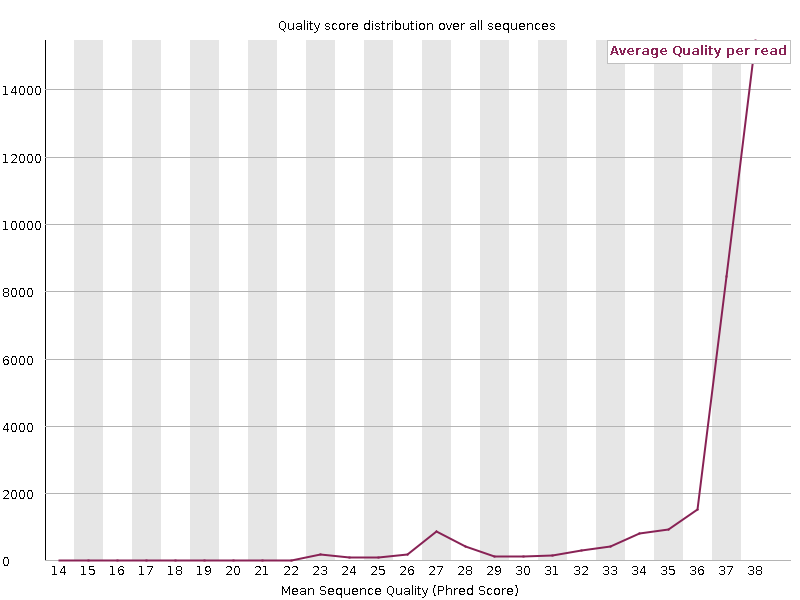
**Figura 2.1.** *Distribución de la calidad media por lectura para R1 sin filtrar. La mayoría de las lecturas presentan una calidad alta (Q37-Q38), con una cola hacia calidades menores*

La Figura 2.2 muestra un aumento progresivo del contenido de adaptadores a lo largo de las posiciones, especialmente a partir de la posición ~150 pb. Esto indica que muchas lecturas contienen secuencias de adaptadores en sus extremos 3'

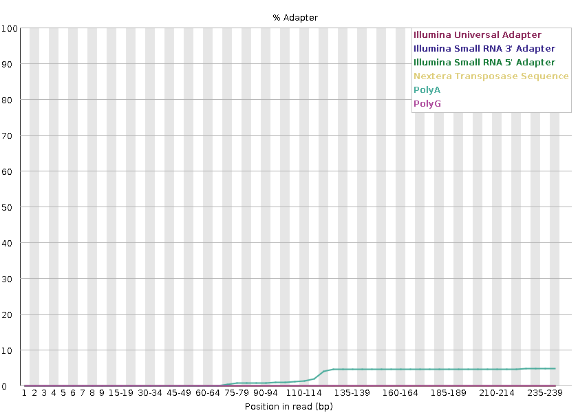
**Figura 2.2.** *Contenido de adaptadores a lo largo de las posiciones para R1 sin filtrar. Se observa un aumento progresivo a partir de la posición 150 pb.*

Como se observa en la Figura 2.3, la calidad por base es excelente al inicio (Q>30), pero cae progresivamente hacia el final de las lecturas, llegando a valores cercanos a Q20 en las últimas posiciones. Esta caída es típica de lecturas largas (251 pb) y refleja errores acumulados durante la secuenciación.

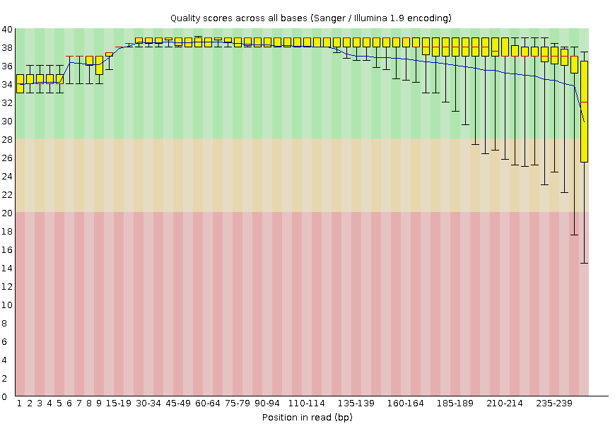
**Figura 2.3.** *Calidad por base a lo largo de las posiciones para R1 sin filtrar. La calidad disminuye progresivamente hacia el final de las lecturas.*

La Figura 2.4 nos permite evaluar si existe algun sesgo en la composición de bases de nuestras lecturas en cada posición.

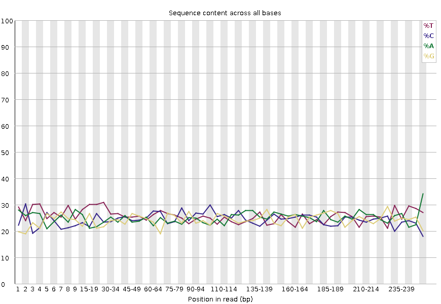
**Figura 2.4.** *Contenido de bases a lo largo de las posiciones para R1 sin filtrar.*

### 2.2.2 S13.R2.fastq.gz

La distribución de la calidad media en R2 muestra un pico en torno a Q33-Q38, pero con una cola más pronunciada hacia calidades bajas (Q20-Q30) en comparación con R1, como se puede observar en la Figura 2.5. 

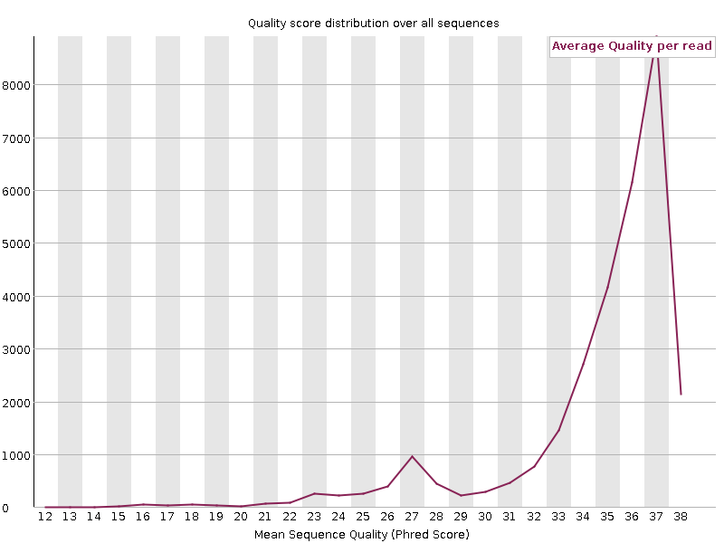
**Figura 2.5.** *Distribución de la calidad media por lectura para R2 sin filtrar. Una gran proporción de lecturas presentan una calidad alta (Q33-Q38), con una cola mas pronuciada que R1 hacia calidades menores*

La Figura 2.6 Nos permite observar que al igual que en R1, se observa un incremento del contenido de adaptadores hacia el final de las lecturas, comenzando incluso antes (posición 49 pb).

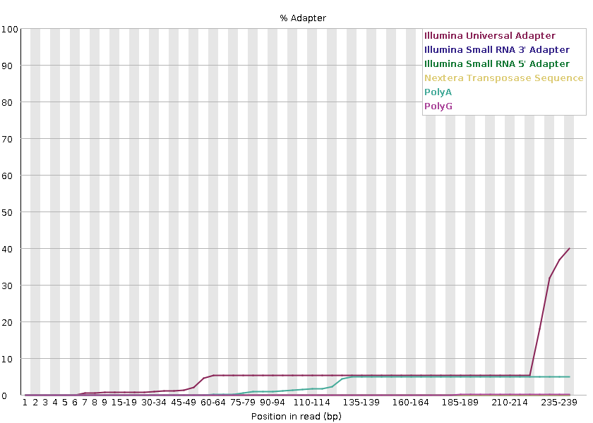
**Figura 2.6.** *Contenido de adaptadores a lo largo de las posiciones para R2 sin filtrar. Se observa un aumento progresivo a partir de la posición 49 pb.*

La Figura 2.7 nos muestra que la caída de calidad es más marcada que en R1, con valores que descienden por debajo de Q20 en las últimas posiciones.

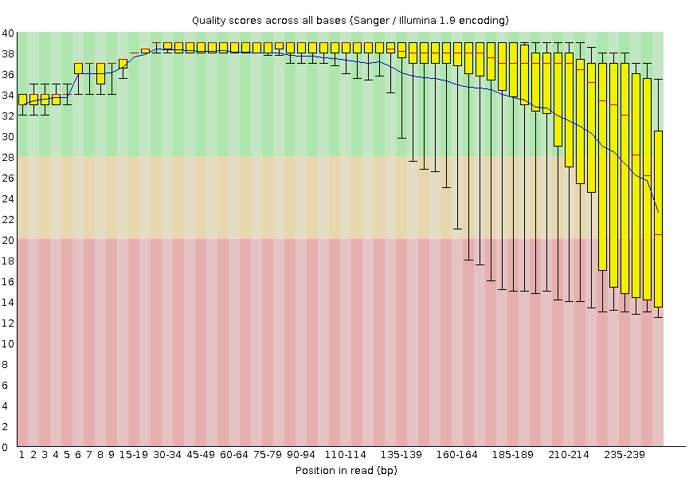
**Figura 2.7.** *Calidad por base a lo largo de las posiciones para R2 sin filtrar. La calidad disminuye  hacia el final de las lecturas.*

La Figura 2.8 nos muestra una composicion similar a R1 respecto a la proporción de nucleotidos por base

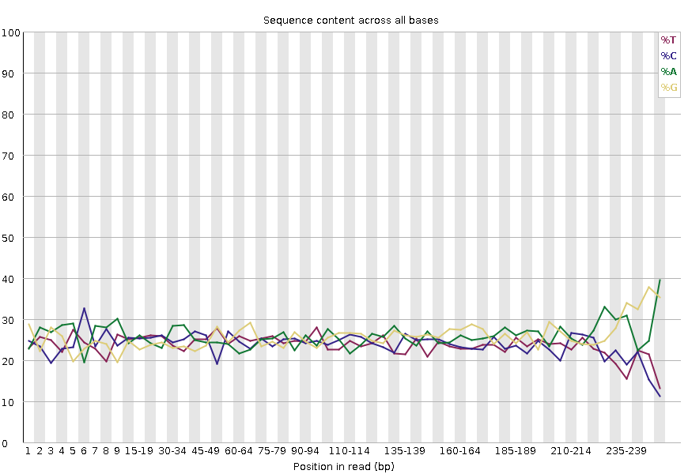
**Figura 2.8.** *Contenido de bases a lo largo de las posiciones para R2 sin filtrar.*

### 2.2.3 S13.R1_filter.fastq.gz

La Figura 2.9 Nos muestra que, tras el filtrado, la distribución de calidad media de R1 se desplaza hacia la derecha, con todas las lecturas superando Q30 y un pico principal en Q38-Q40. Esto indica que las lecturas de baja calidad han sido eliminadas

**Figura 2.9.** *Distribución de la calidad media por lectura para R1 filtrada. Todas las lecturas tienen una calidad media mayor que 30.*

La Figura 2.10 nos muestra que el contenido de adaptadores se reduce en comparación con R1 sin filtrar. La curva se mantiene baja a lo largo de todas las posiciones, lo que confirma que el proceso de filtrado logro eliminar la mayoría de los adaptadores. 

**Figura 2.10.** *Contenido de adaptadores para R1 filtrada. La curva se mantiene baja a lo largo de todas las posiciones.*

La Figura 2.11 nos muestra que la calidad por base se mantiene alta (Q>30) y con baja dispersión a lo largo de toda la longitud de la lectura, con una caída mínima al final para R1 filtrada.

**Figura 2.11.** *Calidad por base para R1 filtrada. La calidad se mantiene alta a lo largo de toda la longitud, cayendo solo en las ultimas posiciones.*

Podemos observar en la Figura 2.12 que la composición de nucleotidos se mantiene similar a las lecturas sin filtrar de R1

**Figura 2.12.** *Contenido de bases a lo largo de las posiciones para R1 filtrada.*

### 2.2.3 S13.R2_filter.fastq.gz

La Figura 2.13 Nos muestra que, tras el filtrado, la distribución de calidad media de R2 se desplaza hacia la derecha, con todas las lecturas superando Q30 y un pico principal en Q38-Q40. Esto indica que las lecturas de baja calidad han sido eliminadas y que aumento drasticamente la calidad de las lecturas de R2.

**Figura 2.13.***Distribución de la calidad media por lectura para R2 filtrada. Todas las lecturas tienen una calidad media mayor que 30.*

La Figura 2.14 nos muestra que el contenido de adaptadores se reduce en comparación con R2 sin filtrar. La curva se mantiene baja a lo largo de todas las posiciones, lo que confirma que el proceso de filtrado logro eliminar la mayoría de los adaptadores de R2. 

**Figura 2.14.** *Contenido de adaptadores para R2 filtrada. La curva se mantiene baja a lo largo de todas las posiciones.*

La Figura 2.15 nos muestra que la calidad por base se mantiene alta (Q>30) y con baja dispersión a lo largo de toda la longitud de la lectura, con una caída mínima al final para R2 filtrada en comparación con R2 sin filtrar.

**Figura 2.15.** *Calidad por base para R2 filtrada. La calidad se mantiene alta a lo largo de toda la longitud, cayendo solo en las ultimas posiciones.*

Podemos observar en la Figura 2.16 que la composición de nucleotidos se mantiene similar a las lecturas sin filtrar de R2

**Figura 2.16.** *Contenido de bases a lo largo de las posiciones para R2 filtrada.*

# Conclusiones 

El desarrollo de este trabajo permitió recorrer las etapas iniciales del análisis de datos de secuenciación, desde la exploración básica de archivos FASTQ mediante comandos Unix hasta la evaluación detallada de la calidad de las lecturas utilizando FastQC. En primer lugar, el uso de comandos Unix permitió familiarizarse con la estructura interna de los archivos FASTQ, identificando claramente las cuatro líneas que componen cada lectura: el identificador precedido por "@", la secuencia de nucleótidos, el separador "+" y la cadena de calidad codificada en ASCII. Asimismo, se pudo evidenciar que los archivos sin filtrar contenían 30,352 lecturas, mientras que los archivos filtrados contenían 26,020, lo que evidencia una reducción atribuible a la eliminación de lecturas de baja calidad o con adaptadores. 

Los reportes generados mediante FastQC para R1 y R2 sin filtrar revelaron fallos en módulos como contenido por base, contenido GC, duplicación y secuencias sobrerrepresentadas, además de un incremento progresivo en el contenido de adaptadores hacia el final de las lecturas. Estos resultados son consistentes con datos crudos que aún no han sido sometidos a ningún proceso de limpieza. En contraste, las versiones filtradas (R1_filter y R2_filter) mostraron que el contenido por base pasó de FAIL a WARNING, el contenido de adaptadores se redujo y la calidad media por lectura se desplazó hacia valores superiores a Q30, con una calidad por base que se mantiene alta a lo largo de toda la longitud de la lectura. No obstante, persistieron fallos en contenido GC, duplicación y secuencias sobrerrepresentadas.

La interpretación de las 16 figuras seleccionadas (Figuras 2.1 a 2.16) permitió explorar de manera visual el impacto que tiene el filtrado sobre la calidad de las lecturas. Los gráficos de calidad media, contenido de adaptadores, calidad por base y contenido de bases evidenciaron que el proceso de limpieza mejoró la calidad de los datos.

En conclusión, este trabajo demuestra que la combinación de herramientas de línea de comandos y programas especializados como FastQC constituye una estrategia para evaluar y mejorar la calidad de datos de secuenciación masiva, donde el filtrado es un paso esencial que mejora la calidad de las lecturas, pero que no sustituye la necesidad de una interpretación crítica de los reportes. 
